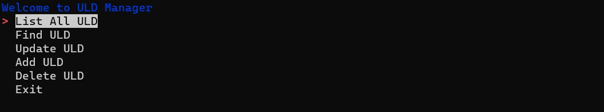

# Phase-3-uld-db-project

Brief description of your CLI application. Explain what it does, its main features, and its intended use case.

## Table of Contents

- [Installation](#installation)
- [Usage](#usage)
- [Commands](#commands)
- [Options](#options)
- [Examples](#examples)
- [Contributing](#contributing)
- [License](#license)

## Installation
Requires Python: 3.8

-Project Repository: 
    -https://github.com/Justin3459/Phase-3-uld-db-project.git
-Dependencies:
    -sqlalchemy = "==1.4.41"
    -alembic = "*"
    -prettycli = "*"
    -simple-term-menu = "*"

Provide instructions on how to install your CLI application. Include any prerequisites or dependencies that need to be installed before using your CLI. If your application is available on package managers like npm, pip, or brew, mention it here.

## Introduction
This CLI application is used to track Unit Load Devices(ULD) once they are on a caster deck. All ULDs are marked as incomplete and once completed the user is able to change the status of the ULD. The features in this application are: List ULD, Update Status, Add ULD, and Delete ULD. This application allows the user to keep track of the status and modify ULD information.

## Features

- List ULD: Allows user to display ULDs that are currently in the database
- Add ULD: Allows user to add new ULDs to the database in the format amz(4 digit number)(ULD type)
- Delete ULD: Allows user to delete Ulds in the database
- Update ULD: Allows user to change the name, caster deck or status of a particular ULD

If a ULD is not in the current database the user will be prompted to enter a valid ULD

## Installation

1. it clone repository in the terminal
2. cd into repository
3. type pipenv install and shell in the terminal
4. run python3 cli.py to start application. If you get a ModuleNotFoundError you can run pip3 install {module name}

## Usage

1. Once inside the repository and the virtual environment. 
2. Type $python3 cli.py

3. Once the CLI has started use the arrow keys to make a selection
4. If "List Uld" is selected it will display all ULD 
5. If "Find ULD" is selected. A prompt to select a ULD type will appear. After ULD is selected the application will will prompt a ULD id. If ULD is in the database it will list: ULD ID, ULD name, caster deck, and status
6. If "Update ULD" is selected. A prompt to select a ULD type will appear then prompt for ULD ID to be typed in. If ULD is in the database you will be able to change the ULD name, caster deck, and status
7. If "Add ULD" or "Delete ULD" is selected the user will be able to input ULD number and type and add it to the database

## License

This project is licensed under the [MIT License](LICENSE).